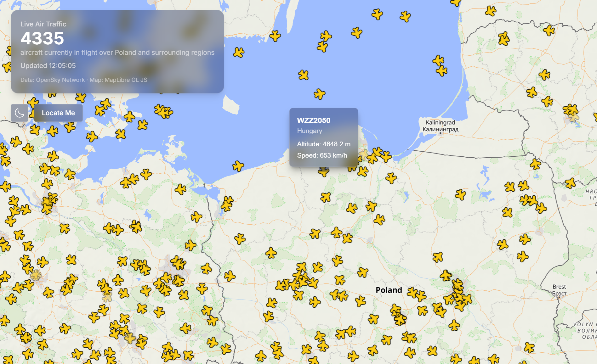
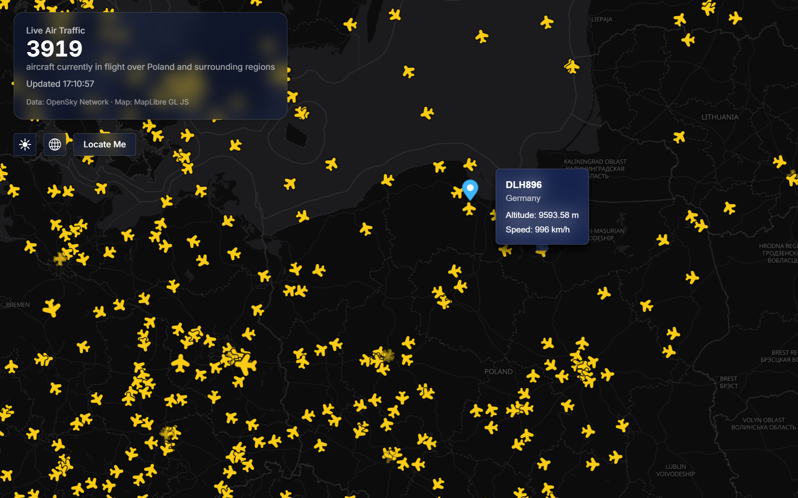
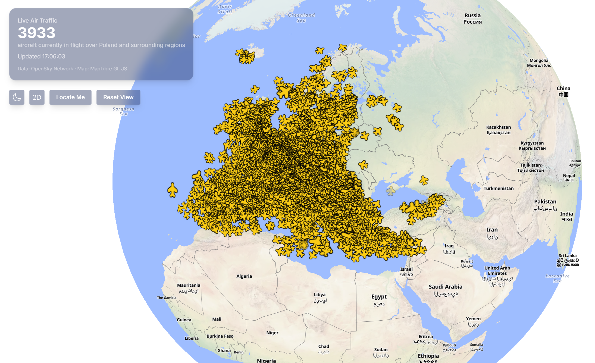

# Air Traffic POC

Live map of air traffic over Europe. Fetches real-time aircraft positions from the OpenSky Network and renders them on a MapLibre GL JS map.

| Light mode | Dark mode | Globe mode |
| --- | --- | --- |
|  |  |  |

## Setup

```
npm install
npm run dev
```

Dev server runs on `localhost:3030` and opens automatically.

### OpenSky credentials (optional but recommended)

Without credentials, requests fall back to OpenSky's anonymous access, which is limited to 400 credits/day and a 10s time resolution — expect frequent `429` responses under regular polling.

To raise that to 4000 credits/day (5s resolution), [register a free OpenSky account](https://opensky-network.org/) and create an API client, then add to a `.env` file in the project root (gitignored):

```
OPENSKY_CLIENT_ID=...
OPENSKY_CLIENT_SECRET=...
```

The dev server (`vite-plugins/openskyProxyPlugin.ts`) exchanges these for an OAuth2 token and caches it until expiry.

## Tech stack

- Vite
- React 19
- TypeScript
- MapLibre GL JS v6
- Tailwind CSS
- OpenSky Network API

## What this demonstrates

- Aircraft rendered as a MapLibre `symbol` layer (WebGL) instead of one DOM marker per plane — scales to thousands of points without DOM overhead.
- Real-time data updates via `source.setData()` on an existing GeoJSON source, instead of re-adding the layer on every fetch.
- Data-driven icon rotation (`icon-rotate` bound to each feature's `heading` property) so plane icons point in their direction of travel.
- CORS handling for a third-party API with no browser-facing CORS support, via a Vite dev-server proxy.
- OAuth2 client-credentials auth against OpenSky, with the access token cached server-side until expiry, to avoid the much stricter anonymous rate limit.
- Aircraft icons authored as SVG but rasterized to canvas at runtime (MapLibre's `addImage` needs raw pixels, and `map.loadImage()` only decodes PNG/JPEG), with a recolor + dilated-outline effect done entirely via canvas compositing.
- Hover-driven popups that track the underlying feature's live position, updating in place as new data arrives instead of freezing at the coordinates from when the hover started.
- Map style swapping (`map.setStyle()` for dark/light mode) with the aircraft source/layer/icons and hover handlers re-attached automatically via the `style.load` event, instead of only once on initial `load`.
- OpenSky's `category` field (via `&extended=1`) drives both which icon renders (helicopter vs. fixed-wing) and its size, via data-driven `match` expressions on `icon-image`/`icon-size` — no per-feature JS branching.
- A small map-control toolbar (locate me, reset view, dark/light style, mercator/globe projection) built as independent components that each just call a method on the shared `Map` instance.

## Known limitations / next steps

- No interpolation between fetches — aircraft jump to their new position on each refresh instead of animating smoothly.
- No clustering — at high aircraft density, symbols will start overlapping.
- The OpenSky proxy only exists in the Vite dev server; a production deployment needs a real backend/serverless proxy in front of the OpenSky API.

## Credits

3D aircraft model by [Crimexix](https://sketchfab.com/Crimexix) on Sketchfab, licensed under [CC BY 4.0](https://creativecommons.org/licenses/by/4.0/).
